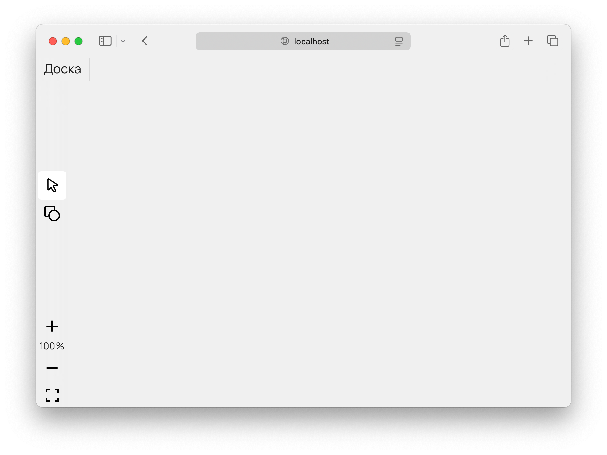
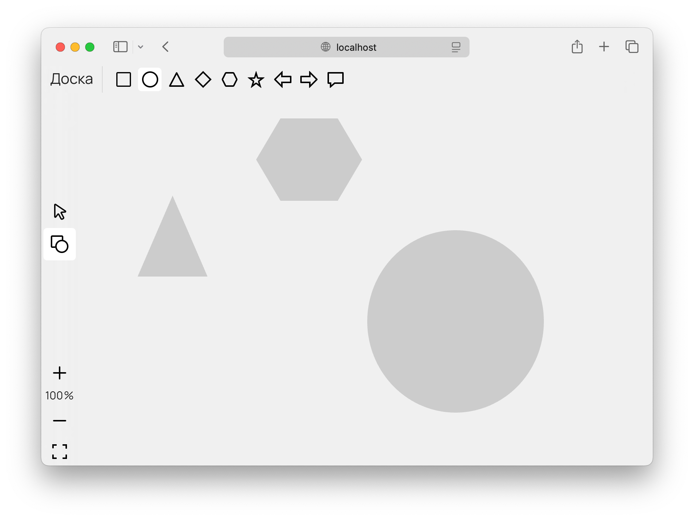
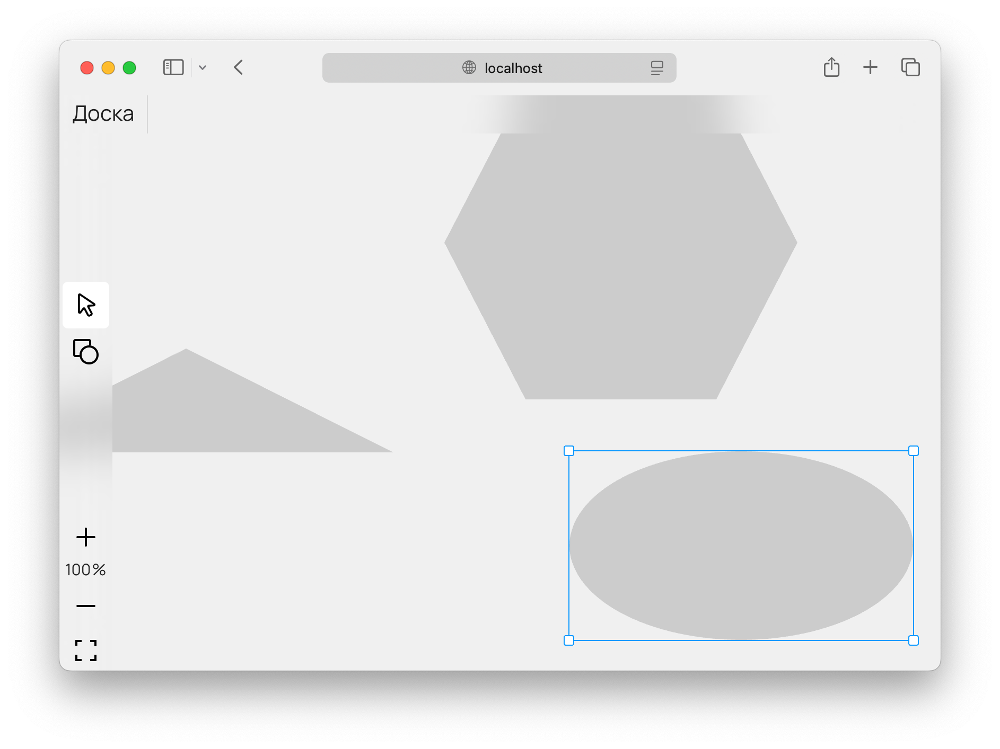
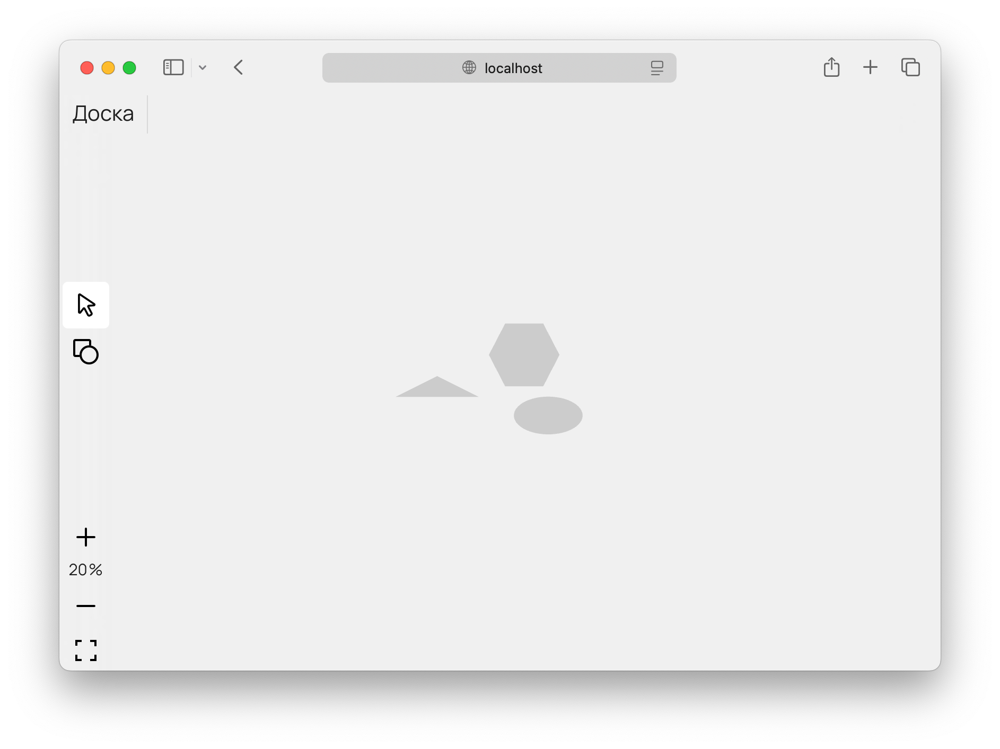
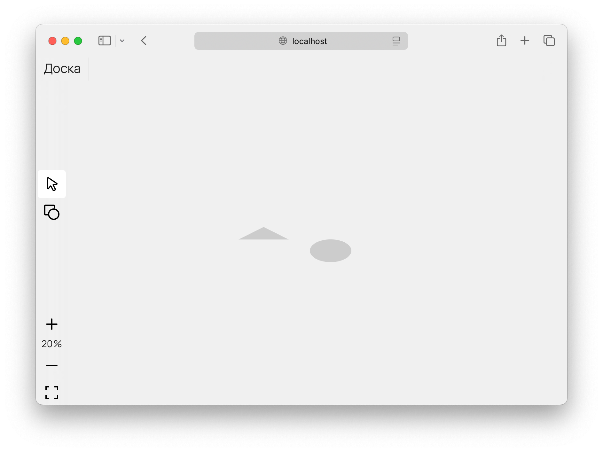

# Доска для рисования геометрических фигур

## Что умеет

Редактор при открытии.


Можно нарисовать 9 вариантов геометрических фигур.


Фигуры можно перемещать и изменять размеры.


Холст можно перемещать и масштабировать.


И поддерживается удаление фигур.



## Запуск

В Терминале перейдите в папку, куда хотите загрузить код примера:
```
cd /Users/andrewkozinsky/Desktop
```

Скачайте код:
```
git clone git@github.com:AndrewKozinsky/board.git
```

Перейдите в папку проекта:
```
cd board
```

Установите зависимости:
```
yarn i
```

Запустите проект:
```
yarn dev
```

В Терминале будет указан адрес открытого проекта в браузере (обычно http://localhost:5173).
